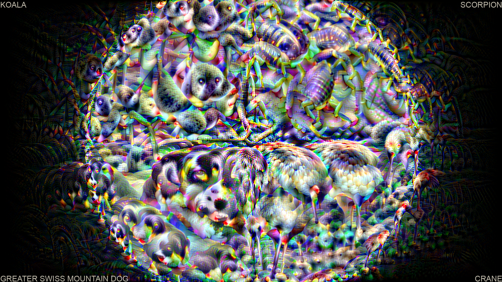

## Deep Dream Movie
This is based on my friend's [deep dream image generation](https://github.com/Laminarkompot/DeepDream_PyTorch).  
I turned it into a Full HD video and added constantly moving distortion.

Example frame:



## To record a video
Run:
```
python dream.py path/to/write/video.mp4
```
